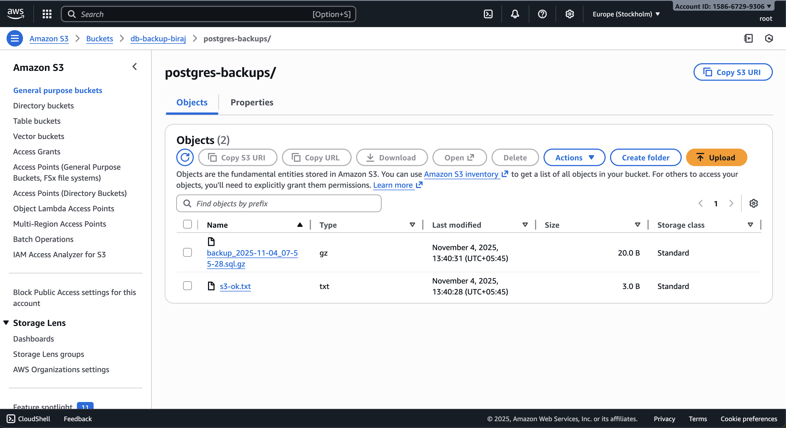

# Automated PostgreSQL Backup to S3

This GitHub Action automatically backs up a PostgreSQL database every 12 hours and uploads the compressed dump to Amazon S3, giving you a hands-off safety net for disaster recovery.

---

## Features

- Automated `pg_dump` backup every 12 hours (GitHub Actions cron)
- Secure upload to Amazon S3
- IAM user scoped to least-privilege access
- Easy database restoration from time-stamped archives

---

## Tech Stack

- **AWS S3 & IAM**
- **PostgreSQL**
- **GitHub Actions**
- **Bash scripting**

---

## Workflow Overview

```yaml
on:
  schedule:
    - cron: "0 */12 * * *"
  workflow_dispatch:

jobs:
  backup:
    runs-on: ubuntu-latest

    steps:
      - name: Checkout repository
        uses: actions/checkout@v4

      - name: Install PostgreSQL client and AWS CLI
        run: |
          sudo apt-get update
          sudo apt-get install -y postgresql-client awscli

      - name: Dump PostgreSQL database
        env:
          PGPASSWORD: ${{ secrets.PG_PASSWORD }}
        run: |
          TIMESTAMP=$(date +'%Y-%m-%d_%H-%M-%S')
          FILE="backup_${TIMESTAMP}.sql.gz"
          pg_dump -h ${{ secrets.PG_HOST }} -p ${{ secrets.PG_PORT }} \
                  -U ${{ secrets.PG_USER }} -d ${{ secrets.PG_DATABASE }} | gzip > $FILE
          echo "Backup created: $FILE"

      - name: Upload to AWS S3
        run: |
          aws s3 cp *.sql.gz s3://${{ secrets.S3_BUCKET }}/postgres-backups/
          echo "Backup uploaded to S3 successfully!"
        env:
          AWS_ACCESS_KEY_ID: ${{ secrets.AWS_ACCESS_KEY_ID }}
          AWS_SECRET_ACCESS_KEY: ${{ secrets.AWS_SECRET_ACCESS_KEY }}
          AWS_REGION: ${{ secrets.AWS_REGION }}
```

---

## Setup Instructions

1. **AWS Setup**

   - Create an S3 bucket (e.g., `db-backup-biraj`) with versioning if you want to keep historical copies.
   - Create an IAM user with least-privilege access to that bucket and generate access keys.

2. **GitHub Secrets**
   Add the following secrets in your repository settings so the workflow can connect to PostgreSQL and S3:

   | Secret                  | Example           |
   | ----------------------- | ----------------- |
   | `AWS_ACCESS_KEY_ID`     | `AKIA...`         |
   | `AWS_SECRET_ACCESS_KEY` | `...`             |
   | `AWS_REGION`            | `us-east-1`       |
   | `S3_BUCKET`             | `db-backup-biraj` |
   | `PG_HOST`               | `db-host`         |
   | `PG_PORT`               | `5432`            |
   | `PG_USER`               | `postgres`        |
   | `PG_PASSWORD`           | `secret`          |
   | `PG_DATABASE`           | `mydb`            |

---

## Verifying Backups

- Trigger the workflow manually (`Actions` tab ➜ `Automated PostgreSQL Backup to S3` ➜ `Run workflow`) or wait for the scheduled run.
- Confirm that a new `backup_YYYY-MM-DD_HH-MM-SS.sql.gz` file appears in your S3 bucket (e.g., `db-backup-biraj/postgres-backups/`), as shown in the screenshot below.
- Download a backup and run `gunzip` followed by `psql` restore commands to test your recovery procedure.

> _Tip:_ Store a copy of your verification screenshot in a docs folder (e.g., `docs/s3-backup.png`) and embed it here for future reference.


